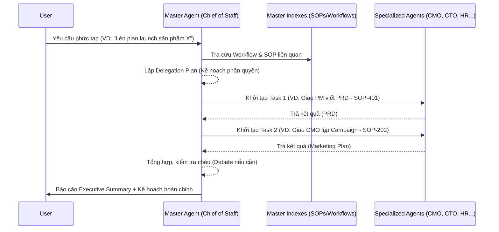

# Master Agent (Chief of Staff) Orchestrator

## Vai trò
**Master Agent** đóng vai trò là "Lõi trung tâm" (Hub) hoặc "Chánh văn phòng" (Chief of Staff). 
Nhà điều hành (Trực tiếp là bạn - User) CHỈ CẦN giao tiếp qua Master Agent này.

## Luồng hoạt động (Workflow)

## Các tính năng cốt lõi
1. **Intent Recognition**: Hiểu yêu cầu người dùng bằng ngôn ngữ tự nhiên.
2. **Context Routing**: Tự động map yêu cầu với `WF-xxx` (Workflow) hoặc `SOP-xxx`.
3. **Execution Planning**: Chia việc lớn thành N việc nhỏ có thứ tự execution.
4. **Agent Delegation**: Spin up đúng agent (VD: `MarketingManager`, `TechLead`) với đúng file `SKILL.md` của agent đó.
5. **Memory Management**: Lưu lại ngữ cảnh chung vào `_shared_memory/`.
